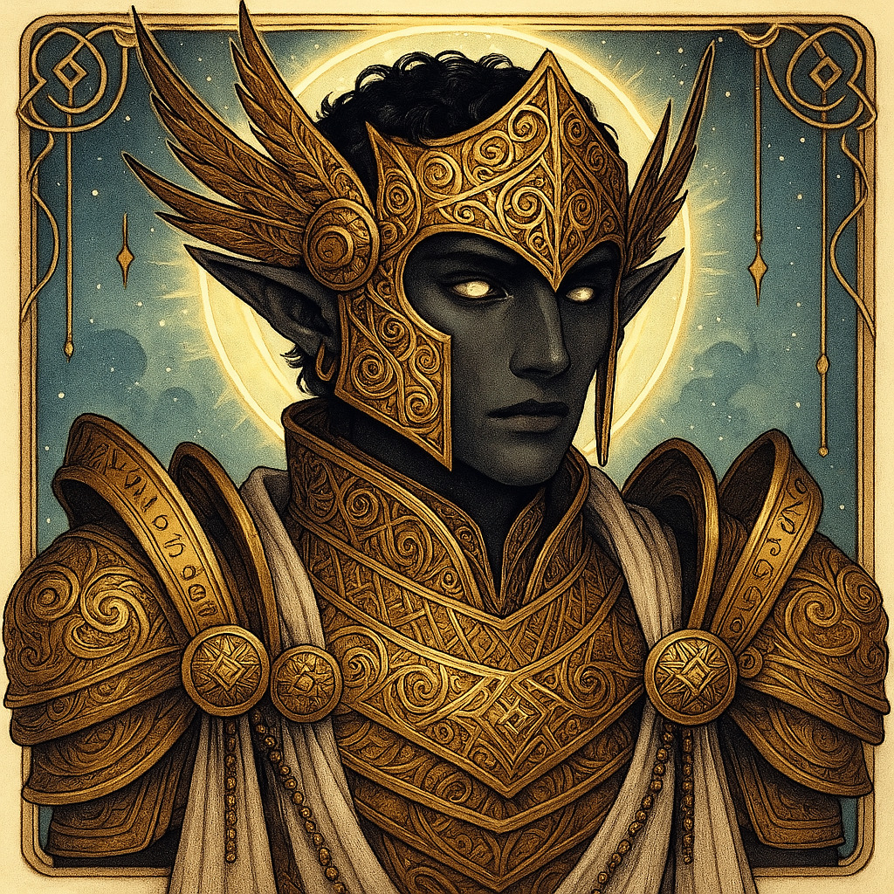

# Amun — (He/Him)

<!-- Optional -->

---

## 📕 Details
**Pronouns:** He/Him  
**Titles/Aliases:**  
  - God of Flight  

**Pre-ascension Species:** [Elf](../../../species/elf/index.md)  
**[Time Period](../../history/time_periods/) of Ascension:** Age of Creation  
**[Pantheon](../../../pantheons):** [Athenians](../../../pantheons/athenians/index.md)  
**Divine Trial:** Invent Powered Flight  
**LGBTQ+ Identifications:**  
  none  

**Other Identifications:**  
  none  

**Theme Music:**  
<audio controls>
  <source src="amun_|_pokemon_hoenn_legendary_battle_theme_(epic_orchestral_remix).mp4" type="audio/mpeg">
  Your browser does not support the audio element.
</audio>

"Pokemon Hoenn Legendary Battle Theme (Epic Orchestral Remix)"  

---

## 🌀 Current Status

---

## 📜 History

---

## 👤 Physical Description

---
## 🧩 Notable Relationships
  -   

---
