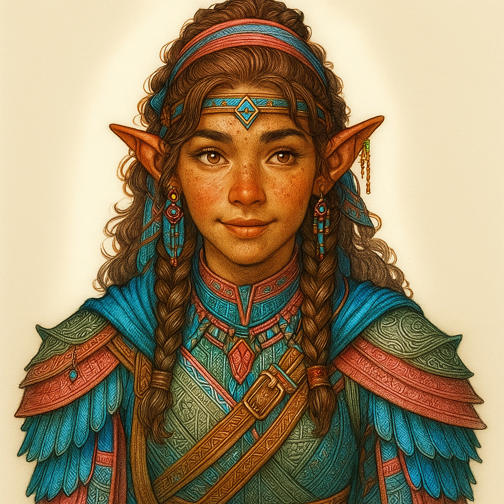

# Aphrodite — (She/Her)

<!-- Optional -->

---

## 📕 Details
**Pronouns:** She/Her  
**Titles/Aliases:**  
  - The Pink God  
  - The God of Escapes  
  - Creator of the Pink Plane  

**Pre-ascension Species:** [Elf](../../../species/elf/index.md)  
**[Time Period](../../history/time_periods/) of Ascension:** Age of Unity  
**[Pantheon](../../../pantheons):** None  
**Divine Trial:** Create a new plane  
**LGBTQ+ Identifications:**  
      
  [Pansexual](../../../identifiers/pansexual/index.md)  
      
  [Transgender](../../../identifiers/transgender/index.md) (MTF)  

**Other Identifications:**  
      
  [Polyamorous](../../../identifiers/polyamorous/index.md)  
      
  [ADHD](../../../identifiers/adhd/index.md)  
      
  [Autism](../../../identifiers/autism/index.md)  

**Theme Music:**  
<audio controls>
  <source src="aphrodite_|_spider_dance-_orchestral_swing_remix.mp4" type="audio/mpeg">
  Your browser does not support the audio element.
</audio>

"Spider Dance- Orchestral swing remix"  

---

## 🌀 Current Status
Traveling the Multi-verse

---

## 📜 History
Escaped the God Onboarding Room

---

## 👤 Physical Description

---
## 🧩 Notable Relationships
  - [Hephaestus](../hephaestus/index.md) - (partner)  
  - [Delinette](../delinette/index.md) - (partner)  
  - [Hades](../hades/index.md) - (pseudo friend/stalker /joke)  

---
