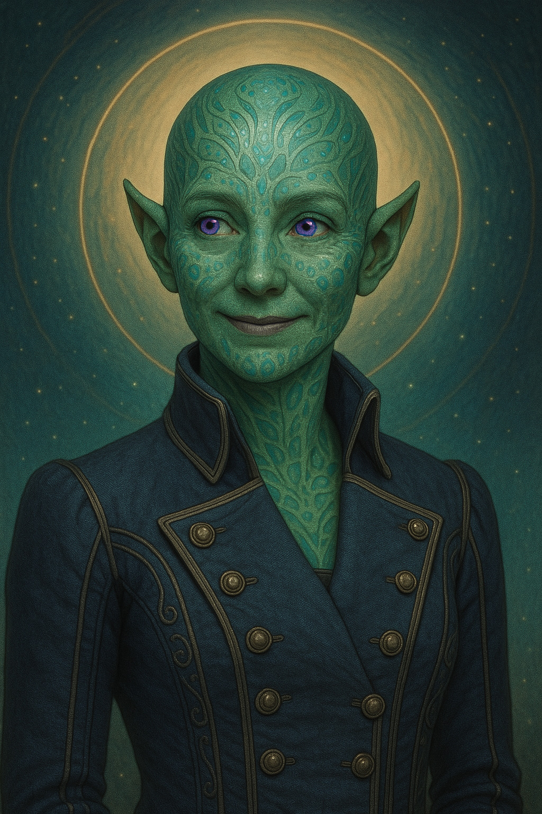

# Delinette — (she/they)

<!-- Optional -->

---

## 📕 Details
**Pronouns:** she/they  
**Titles/Aliases:**  
  - God of Space and Difficult Travel  

**Pre-ascension Species:** Quall  
**[Time Period](../../history/time_periods/) of Ascension:** Age of Unity  
**[Pantheon](../../../pantheons):** [Athenians](../../../pantheons/athenians/index.md)  
**Divine Trial:** Go to a different Universe  
**LGBTQ+ Identifications:**  
      
  [Demigirl](../../../identifiers/demigirl/index.md)  
      
  [Pansexual](../../../identifiers/pansexual/index.md)  

**Other Identifications:**  
      
  [Polyamorous](../../../identifiers/polyamorous/index.md)  

**Theme Music:**  
<audio controls>
  <source src="delinette_|_halo_4_ost_-_117.mp4" type="audio/mpeg">
  Your browser does not support the audio element.
</audio>

"Halo 4 OST - 117"  

---

## 🌀 Current Status

---

## 📜 History

---

## 👤 Physical Description

---
## 🧩 Notable Relationships
  - [Aphrodite](../aphrodite/index.md) - (partner)  
  - [Hephaestus](../hephaestus/index.md) - (partner)  

---
