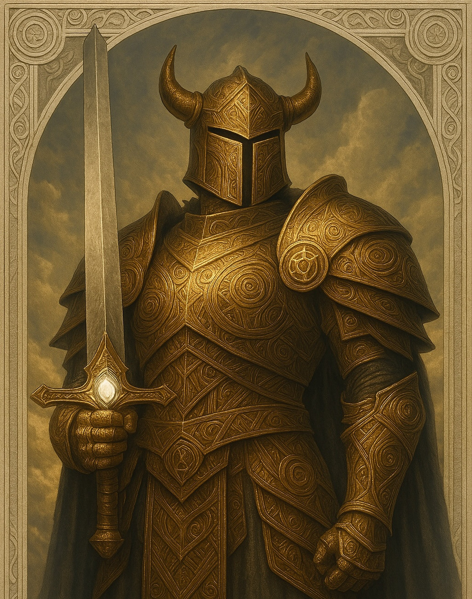

# Eris — (She/Her)

<!-- Optional -->

---

## 📕 Details
**Pronouns:** She/Her  
**Titles/Aliases:**  
  - God of Conflict  

**Pre-ascension Species:** Narn  
**[Time Period](../../history/time_periods/) of Ascension:** Age of Division  
**[Pantheon](../../../pantheons):** [Underworlders](../../../pantheons/underworlders/index.md)  
**Divine Trial:** Conquer Sylvarus  
**LGBTQ+ Identifications:**  
  none  

**Other Identifications:**  
  none  

**Theme Music:**  
<audio controls>
  <source src="eris_|_bfg_division.mp4" type="audio/mpeg">
  Your browser does not support the audio element.
</audio>

"BFG division"  

---

## 🌀 Current Status

---

## 📜 History

---

## 👤 Physical Description

---
## 🧩 Notable Relationships
  - [Ares](../ares/index.md) - Twin Brother  

---
