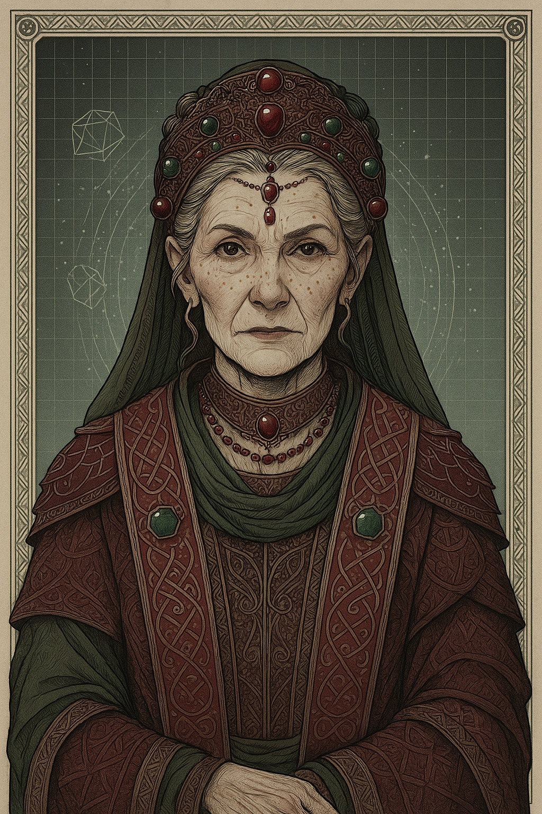

# Fortuna — (She/Her)

<!-- Optional -->

---

## 📕 Details
**Pronouns:** She/Her  
**Titles/Aliases:**  
  - Mother Fortune  

**Pre-ascension Species:** [Human](../../../species/human/index.md)  
**[Time Period](../../history/time_periods/) of Ascension:** The Forgotten Age  
**[Pantheon](../../../pantheons):** [Fortunians](../../../pantheons/fortunians/index.md)  
**Divine Trial:** Unknown  
**LGBTQ+ Identifications:**  
  none  

**Other Identifications:**  
  none  

**Theme Music:**  
<audio controls>
  <source src="fortuna_|_o_fortuna_(carmina_burana_-_carl_orff).mp4" type="audio/mpeg">
  Your browser does not support the audio element.
</audio>

"O Fortuna (Carmina Burana - Carl Orff)"  

---

## 🌀 Current Status

---

## 📜 History

---

## 👤 Physical Description

---
## 🧩 Notable Relationships
  - [Gilgamesh](../gilgamesh/index.md) - (Rival)  

---
