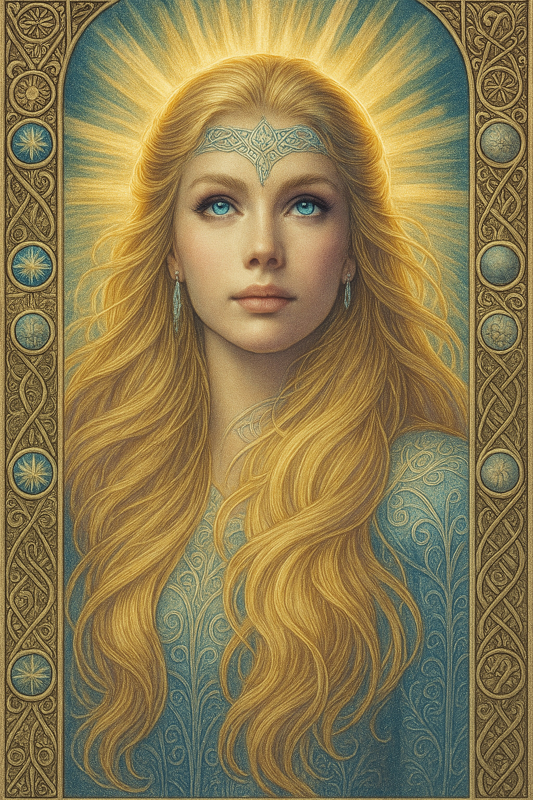

# Freija — (She/Her)

<!-- Optional -->

---

## 📕 Details
**Pronouns:** She/Her  
**Titles/Aliases:**  
  -   

**Pre-ascension Species:** [Human](../../../species/human/index.md)  
**[Time Period](../../history/time_periods/) of Ascension:** Age of Unity  
**[Pantheon](../../../pantheons):** [Demerans](../../../pantheons/demerans/index.md)  
**Divine Trial:** Make peace between [humans](../../../species/human/index.md) and the narn  
**LGBTQ+ Identifications:**  
      
  [Bicurious](../../../identifiers/bicurious/index.md)  

**Other Identifications:**  
  none  

**Theme Music:**  
<audio controls>
  <source src="freija_|_skáld_-_ginnunga_(vikings_chant).mp4" type="audio/mpeg">
  Your browser does not support the audio element.
</audio>

"SKÁLD - Ginnunga (Vikings Chant)"  

---

## 🌀 Current Status

---

## 📜 History

---

## 👤 Physical Description

---
## 🧩 Notable Relationships
  -   

---
