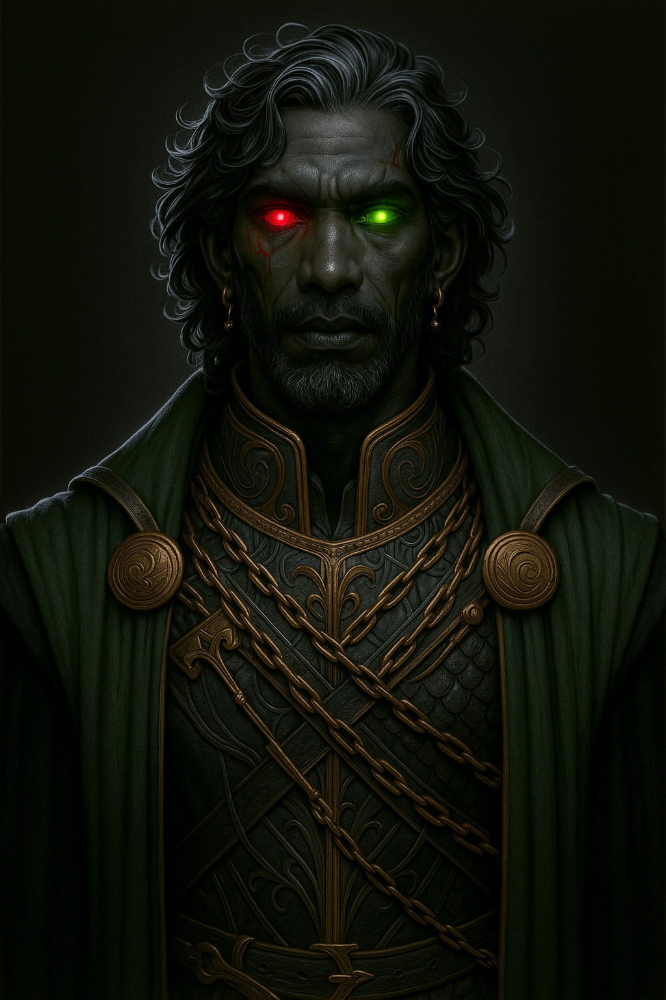

# Hades — (He/Him)

<!-- Optional -->

---

## 📕 Details
**Pronouns:** He/Him  
**Titles/Aliases:**  
  - God of the Underworld  

**Pre-ascension Species:** Half-Elf  
**[Time Period](../../history/time_periods/) of Ascension:** The God Wars  
**[Pantheon](../../../pantheons):** [Underworlders](../../../pantheons/underworlders/index.md)  
**Divine Trial:** Create A resting place for the dead  
**LGBTQ+ Identifications:**  
  none  

**Other Identifications:**  
      
  [Autism](../../../identifiers/autism/index.md)  

**Theme Music:**  
<audio controls>
  <source src="hades_|_hades_-_god_of_the_dead.mp4" type="audio/mpeg">
  Your browser does not support the audio element.
</audio>

"Hades - God of the Dead"  

---

## 🌀 Current Status
Managing the Underworld

---

## 📜 History

---

## 👤 Physical Description

---
## 🧩 Notable Relationships
  - [Persephone](../../demigods/persephone/index.md) - (wife)  
  - [Aphrodite](../aphrodite/index.md) - (curious acquaintance)  
  - [Demeter](../demeter/index.md) - (friend former)  
  - Charon - (created construct and employee)  
  - [Eris](../eris/index.md) - (employee)  
  - [Thanatos](../thanatos/index.md) - (loosely connected contractor)  
  - [Osiris](../osiris/index.md) - (employee)  

---
