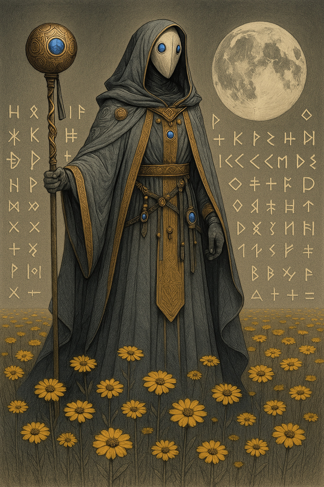

# Halacaster — (They/Them)

<!-- Optional -->

---

## 📕 Details
**Pronouns:** They/Them  
**Titles/Aliases:**  
  - The God of Spellcraft  

**Pre-ascension Species:** secret  
**[Time Period](../../history/time_periods/) of Ascension:** Age of Magic  
**[Pantheon](../../../pantheons):** [Athenians](../../../pantheons/athenians/index.md)  
**Divine Trial:** Stop the growth of the planar leaks  
**LGBTQ+ Identifications:**  
      
  [Nonbinary](../../../identifiers/nonbinary/index.md)  

**Other Identifications:**  
      
  [Neurodivergent](../../../identifiers/neurodivergent/index.md)  

**Theme Music:**  
<audio controls>
  <source src="halacaster_|_carter_burwell_–_main_theme_mr._holmes.mp4" type="audio/mpeg">
  Your browser does not support the audio element.
</audio>

"Carter Burwell – Main theme Mr. Holmes"  

---

## 🌀 Current Status

---

## 📜 History

---

## 👤 Physical Description

---
## 🧩 Notable Relationships
  - [Anuke](../anuke/index.md) - (partner)  

---
