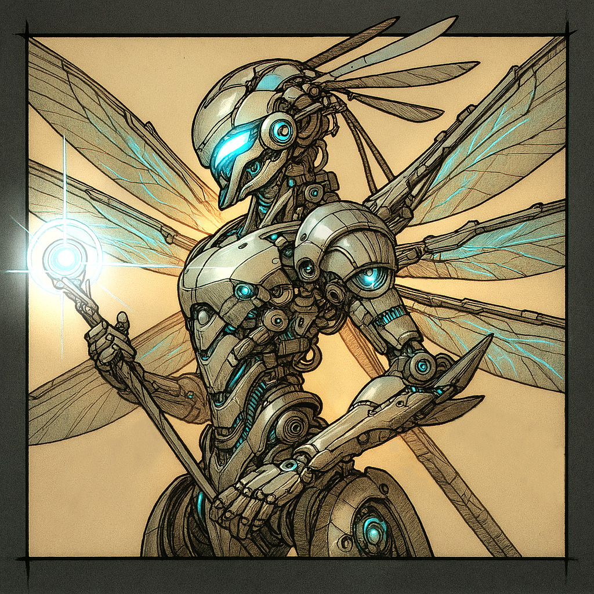

# Hephaestus — (any/all)

<!-- Optional -->

---

## 📕 Details
**Pronouns:** any/all  
**Titles/Aliases:**  
  - God of Crafts and Perfectionism  

**Pre-ascension Species:** [Human](../../../species/human/index.md)  
**[Time Period](../../history/time_periods/) of Ascension:** Age of Creation  
**[Pantheon](../../../pantheons):** [Athenians](../../../pantheons/athenians/index.md)  
**Divine Trial:** Build the greatest weapon ever made  
**LGBTQ+ Identifications:**  
      
  [Agender](../../../identifiers/agender/index.md)  
      
  [Pansexual](../../../identifiers/pansexual/index.md)  

**Other Identifications:**  
      
  [Autism](../../../identifiers/autism/index.md)  
      
  [Polyamorous](../../../identifiers/polyamorous/index.md)  

**Theme Music:**  
<audio controls>
  <source src="hepheastus_|_another_medium.mp4" type="audio/mpeg">
  Your browser does not support the audio element.
</audio>

"Another Medium"  

---

## 🌀 Current Status
Traveling the multi-verse

---

## 📜 History

---

## 👤 Physical Description

---
## 🧩 Notable Relationships
  - [Athena](../athena/index.md) - (Friend)  

---
