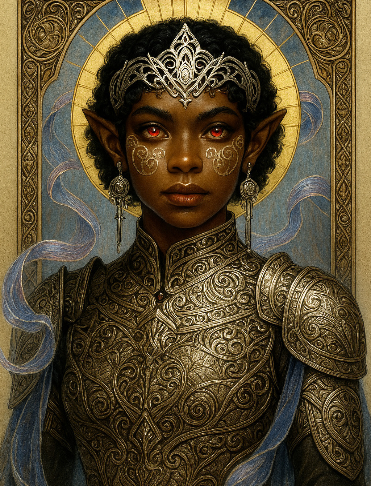

# Hera — (She/Her)

<!-- Optional -->

---

## 📕 Details
**Pronouns:** She/Her  
**Titles/Aliases:**  
  - Godqueen  

**Pre-ascension Species:** [Elf](../../../species/elf/index.md)  
**[Time Period](../../history/time_periods/) of Ascension:** Age of Division  
**[Pantheon](../../../pantheons):** [Demerans](../../../pantheons/demerans/index.md)  
**Divine Trial:** Build a harmonious state of people  
**LGBTQ+ Identifications:**  
  None  

**Other Identifications:**  
  none  

**Theme Music:**  
<audio controls>
  <source src="hera_|_pokemon_primal_dialga_battle_theme_(epic_orchestral_remix).mp4" type="audio/mpeg">
  Your browser does not support the audio element.
</audio>

"Pokemon Primal Dialga Battle Theme (Epic Orchestral Remix)"  

---

## 🌀 Current Status

---

## 📜 History

---

## 👤 Physical Description

---
## 🧩 Notable Relationships
  - [Zeus](../zeus/index.md) - (Mentor)  

---
