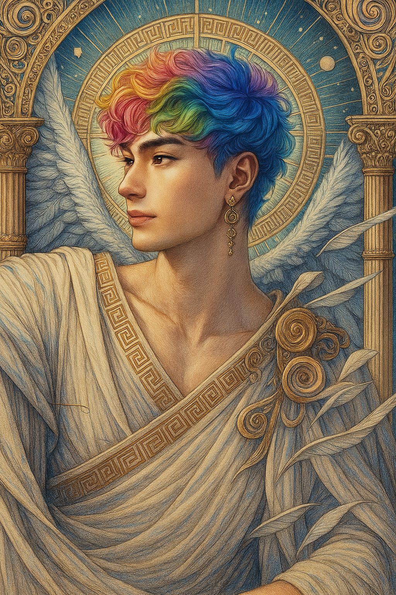

# Hermes — (He/Him)

<!-- Optional -->

---

## 📕 Details
**Pronouns:** He/Him  
**Titles/Aliases:**  
  - God of Science and Regret  

**Pre-ascension Species:** [human](../../../species/human/index.md)  
**[Time Period](../../history/time_periods/) of Ascension:** Age of Division  
**[Pantheon](../../../pantheons):** [Zagarans](../../../pantheons/zagarans/index.md)  
**Divine Trial:** Deliver a message  
**LGBTQ+ Identifications:**  
      
  [Bicurious](../../../identifiers/bicurious/index.md)  

**Other Identifications:**  
  none  

**Theme Music:**  
<audio controls>
  <source src="hermes_|_marvelous_battle_ost's:_tsuna_awakes.mp4" type="audio/mpeg">
  Your browser does not support the audio element.
</audio>

"Marvelous Battle OST's: Tsuna Awakes"  

---

## 🌀 Current Status

---

## 📜 History

---

## 👤 Physical Description

---
## 🧩 Notable Relationships
  - [Dionysus](../dionysus/index.md) - (great friend (with sexual tension))  

---
