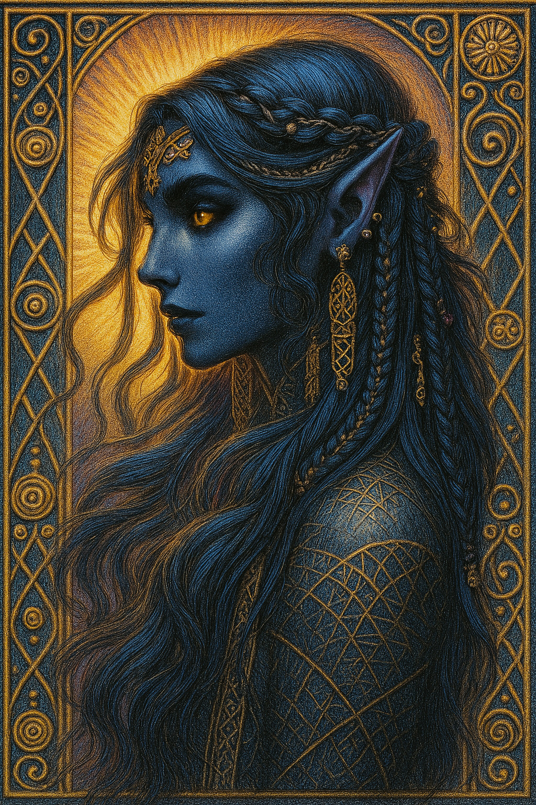

# Hestia — (She/Her)

<!-- Optional -->

---

## 📕 Details
**Pronouns:** She/Her  
**Titles/Aliases:**  
  - God of Fire and Peace  

**Pre-ascension Species:** [Elf](../../../species/elf/index.md)  
**[Time Period](../../history/time_periods/) of Ascension:** Age of Division  
**[Pantheon](../../../pantheons):** [Zagarans](../../../pantheons/zagarans/index.md)  
**Divine Trial:** Achieve Inner Piece  
**LGBTQ+ Identifications:**  
      
  [Pansexual](../../../identifiers/pansexual/index.md)  

**Other Identifications:**  
      
  [Polyamorous](../../../identifiers/polyamorous/index.md)  

**Theme Music:**  
<audio controls>
  <source src="hestia_|_minecraft_-_pigstep_orchestral_cover.mp4" type="audio/mpeg">
  Your browser does not support the audio element.
</audio>

"Minecraft - Pigstep Orchestral Cover"  

---

## 🌀 Current Status

---

## 📜 History

---

## 👤 Physical Description

---
## 🧩 Notable Relationships
  - [Zeus](../zeus/index.md) - Great friend  

---
