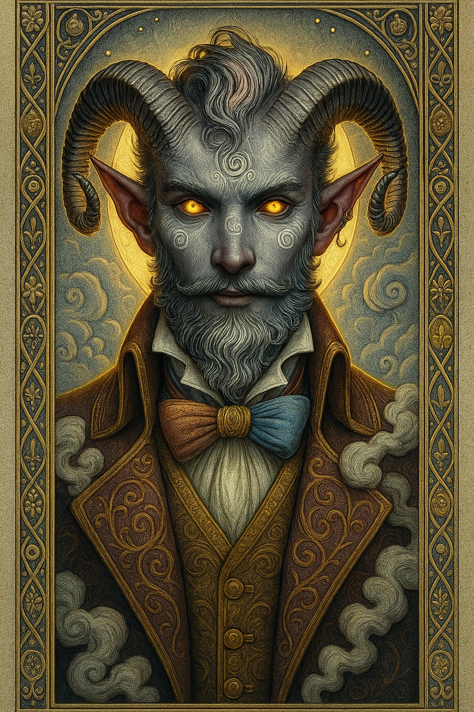

# Loki — (He/Him)

<!-- Optional -->

---

## 📕 Details
**Pronouns:** He/Him  
**Titles/Aliases:**  
  - God of Dealmaking  

**Pre-ascension Species:** Tiefling  
**[Time Period](../../history/time_periods/) of Ascension:** Age of Division  
**[Pantheon](../../../pantheons):** [Underworlders](../../../pantheons/underworlders/index.md)  
**Divine Trial:** Make a permanent doorway to the fey wilds  
**LGBTQ+ Identifications:**  
      
  [Transgender](../../../identifiers/transgender/index.md) (FTM)  

**Other Identifications:**  
      
  [disabled](../../../identifiers/disabled/index.md) (missing left arm)  

**Theme Music:**  
<audio controls>
  <source src="loki_|_corpse_party:_blood_covered_ost_-_chapter_1's_main_theme_(extended).mp4" type="audio/mpeg">
  Your browser does not support the audio element.
</audio>

"Corpse Party: Blood Covered OST - Chapter 1's Main Theme (Extended)"  

---

## 🌀 Current Status

---

## 📜 History

---

## 👤 Physical Description

---
## 🧩 Notable Relationships
  -   

---
