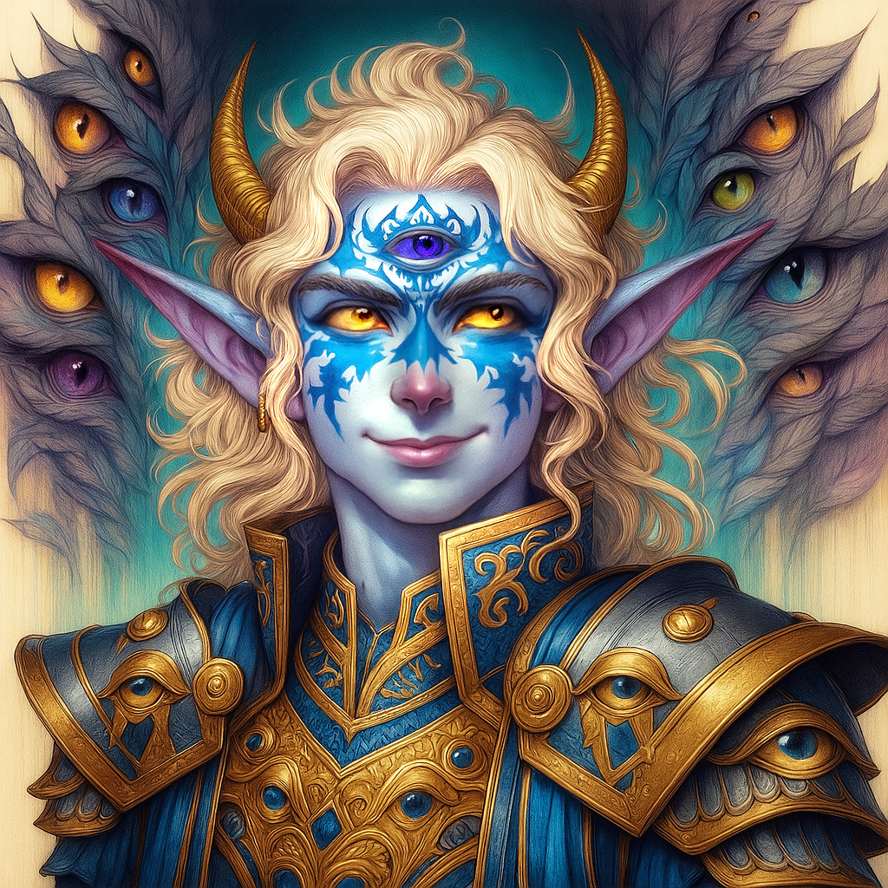

# Midas — (doesn't care)

<!-- Optional -->

---

## 📕 Details
**Pronouns:** doesn't care  
**Titles/Aliases:**  
  - The God of a thousand eyes and ears  

**Pre-ascension Species:** Unknown  
**[Time Period](../../history/time_periods/) of Ascension:** The God Wars  
**[Pantheon](../../../pantheons):** Midasians  
**Divine Trial:** Create the Philosopher's Stone  
**LGBTQ+ Identifications:**  
      
  [Agender](../../../identifiers/agender/index.md)  

**Other Identifications:**  
  none  

**Theme Music:**  
<audio controls>
  <source src="midas_|_pearl:_approaching_champion_cynthia_piano_etude_(extended).mp4" type="audio/mpeg">
  Your browser does not support the audio element.
</audio>

"Pearl: Approaching Champion Cynthia Piano Etude (Extended)"  

---

## 🌀 Current Status

---

## 📜 History

---

## 👤 Physical Description

---
## 🧩 Notable Relationships
  -   

---
