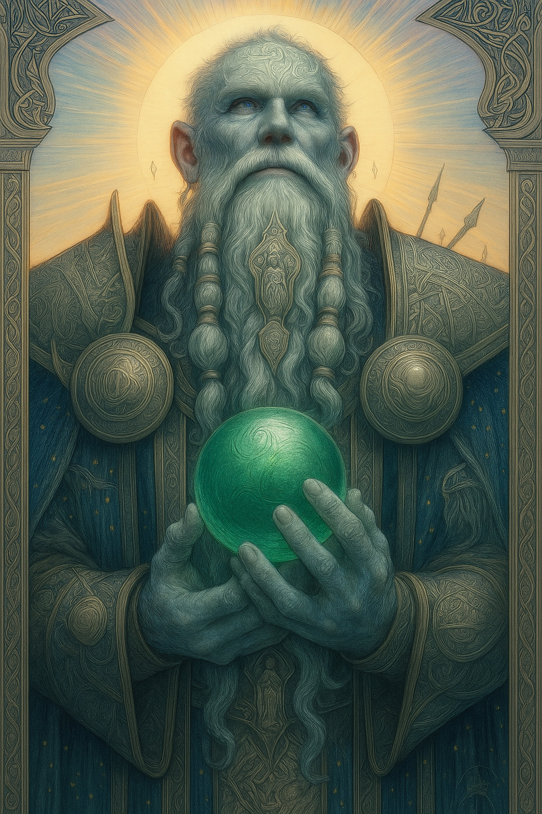

# Odinn — (He/Him)

<!-- Optional -->

---

## 📕 Details
**Pronouns:** He/Him  
**Titles/Aliases:**  
  - The God of Honor and Temperance  

**Pre-ascension Species:** Narn  
**[Time Period](../../history/time_periods/) of Ascension:** Age of Chaos  
**[Pantheon](../../../pantheons):** [Gilgamites](../../../pantheons/gilgamites/index.md)  
**Divine Trial:** Live an Honorable life and die and Honorable death  
**LGBTQ+ Identifications:**  
      
  [Gay (MLM)](../../../identifiers/mlm/index.md)  

**Other Identifications:**  
  none  

**Theme Music:**  
<audio controls>
  <source src="odinn_|_halo_3_odst_ost_disk_1_track_6_asphalt_and_ablution.mp4" type="audio/mpeg">
  Your browser does not support the audio element.
</audio>

"Halo 3 ODST OST Disk 1 Track 6 Asphalt and Ablution"  

---

## 🌀 Current Status
Living in a cabin with Alytica in the far reaches of the Astral plane

---

## 📜 History

---

## 👤 Physical Description

---
## 🧩 Notable Relationships
  - Alytica - (husband)  

---
