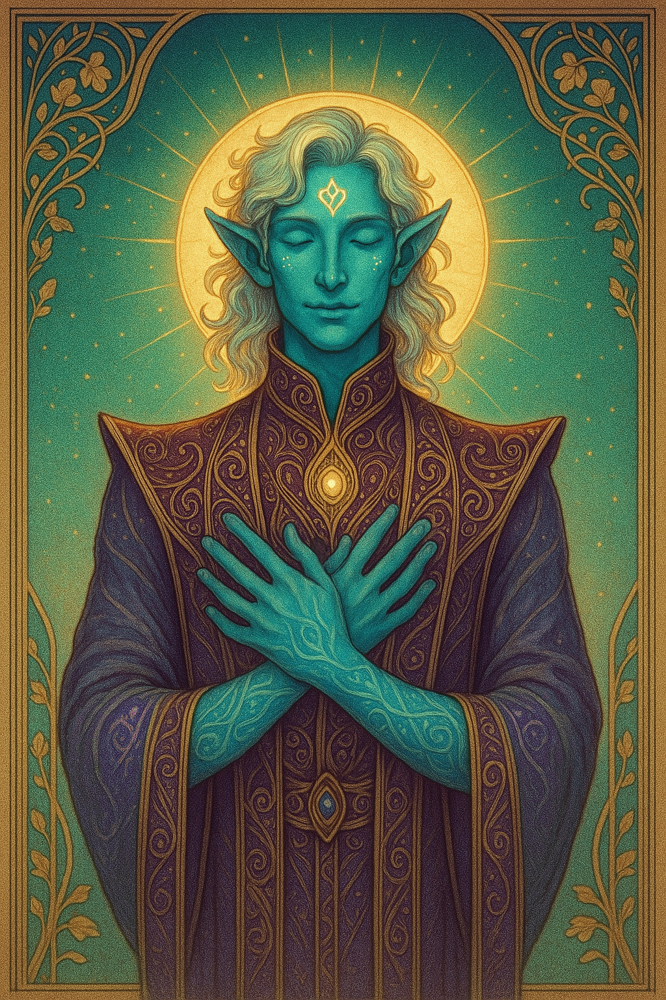

# Orpheus — (he/they)

<!-- Optional -->

---

## 📕 Details
**Pronouns:** he/they  
**Titles/Aliases:**  
  - God of Music and Investigation  

**Pre-ascension Species:** half-elf  
**[Time Period](../../history/time_periods/) of Ascension:** Age of Magic  
**[Pantheon](../../../pantheons):** [Zagarans](../../../pantheons/zagarans/index.md)  
**Divine Trial:** Replay the first song ever written  
**LGBTQ+ Identifications:**  
      
  [Demiboy](../../../identifiers/demiboy/index.md)  

**Other Identifications:**  
  none  

**Theme Music:**  
<audio controls>
  <source src="Orpheus | The Epic Of [Gilgamesh](../gilgamesh/index.md) In Sumerian.mp3" type="audio/mpeg">
  Your browser does not support the audio element.
</audio>

"The Epic Of [Gilgamesh](../gilgamesh/index.md) In Sumerian"  

---

## 🌀 Current Status

---

## 📜 History

---

## 👤 Physical Description

---
## 🧩 Notable Relationships
  - [Eurydice](../../demigods/eurydice/index.md) - (wife)  

---
