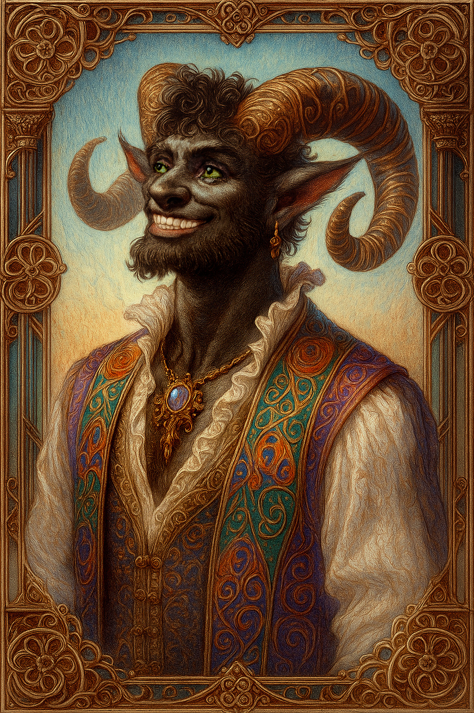

# Pan — (He/Him)

<!-- Optional -->

---

## 📕 Details
**Pronouns:** He/Him  
**Titles/Aliases:**  
  - God of Friendship  

**Pre-ascension Species:** Satyr  
**[Time Period](../../history/time_periods/) of Ascension:** Age of Chaos  
**[Pantheon](../../../pantheons):** [Zagarans](../../../pantheons/zagarans/index.md)  
**Divine Trial:**   
**LGBTQ+ Identifications:**  
      
  [Pansexual](../../../identifiers/pansexual/index.md)  

**Other Identifications:**  
  none  

**Theme Music:**  
<audio controls>
  <source src="pan_|_let's_dance,_boys!_-_super_smash_bros._ultimate.mp4" type="audio/mpeg">
  Your browser does not support the audio element.
</audio>

"Let's Dance, Boys! - Super Smash Bros. Ultimate"  

---

## 🌀 Current Status

---

## 📜 History

---

## 👤 Physical Description

---
## 🧩 Notable Relationships
  -   

---
