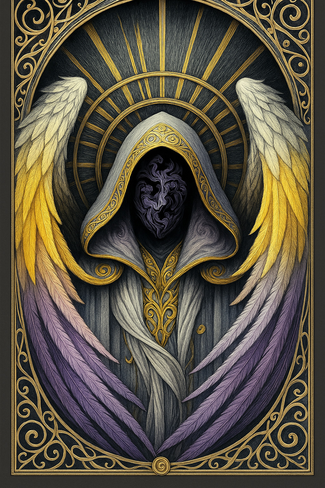

# Thanatos — (They/Them)

<!-- Optional -->

---

## 📕 Details
**Pronouns:** They/Them  
**Titles/Aliases:**  
  - Current God of Death  

**Pre-ascension Species:** Celestial  
**[Time Period](../../history/time_periods/) of Ascension:** Age of Division  
**[Pantheon](../../../pantheons):** None  
**Divine Trial:** Kill the god of Death  
**LGBTQ+ Identifications:**  
      
  [Nonbinary](../../../identifiers/nonbinary/index.md)  

**Other Identifications:**  
      
  [Autism](../../../identifiers/autism/index.md)  

**Theme Music:**  
<audio controls>
  <source src="Thanatos - Medieval Chant 'Dies Irae' - Epic background sound edit slowed.mp3" type="audio/mpeg">
  Your browser does not support the audio element.
</audio>

"Medieval Chant 'Dies Irae' - Epic background sound edit slowed"  

---

## 🌀 Current Status

---

## 📜 History

---

## 👤 Physical Description

---
## 🧩 Notable Relationships
  -   

---
