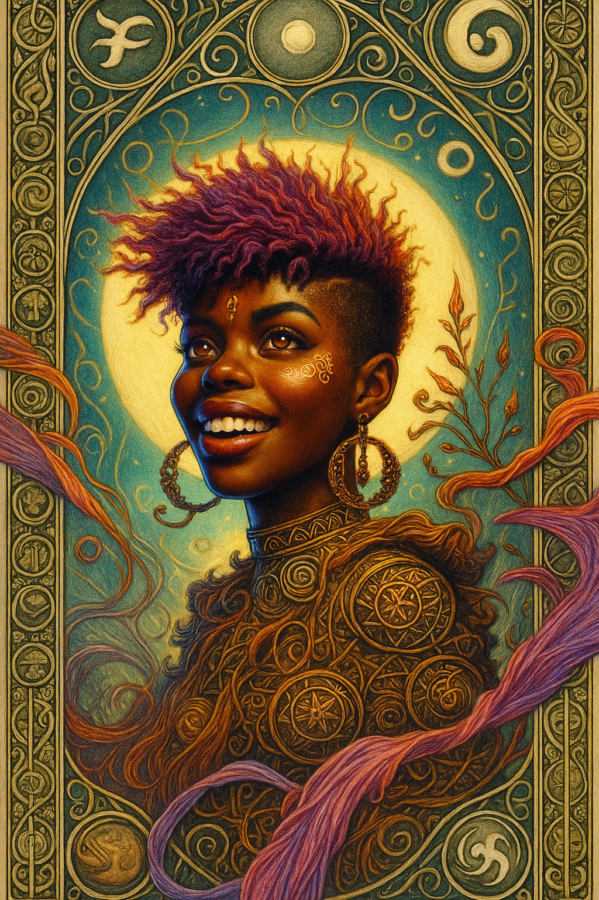

# Valentina — (She/Her)

<!-- Optional -->

---

## 📕 Details
**Pronouns:** She/Her  
**Titles/Aliases:**  
  -   

**Pre-ascension Species:** [human](../../../species/human/index.md)  
**[Time Period](../../history/time_periods/) of Ascension:** The God Wars  
**[Pantheon](../../../pantheons):** [Fortunians](../../../pantheons/fortunians/index.md)  
**Divine Trial:** Unknown  
**LGBTQ+ Identifications:**  
      
  [Lesbian](../../../identifiers/lesbian/index.md)  

**Other Identifications:**  
      
  [ADHD](../../../identifiers/adhd/index.md)  

**Theme Music:**  
<audio controls>
  <source src="valentina_|_chopin_-_waltz_in_c_sharp_minor_(op._64_no._2).mp4" type="audio/mpeg">
  Your browser does not support the audio element.
</audio>

"Chopin - Waltz in C Sharp Minor (Op. 64 No. 2)"  

---

## 🌀 Current Status

---

## 📜 History

---

## 👤 Physical Description

---
## 🧩 Notable Relationships
  - [Nyx](../nyx/index.md) - (Wife)  
  - [Fortuna](../fortuna/index.md) - (Boss/mentor)  

---
