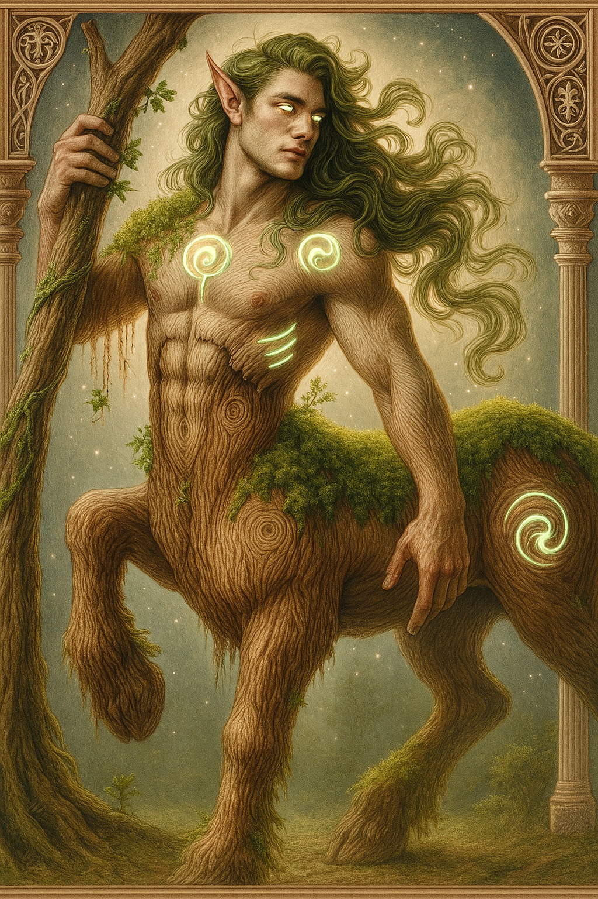

# Versengeterix — (He/Him)

<!-- Optional -->

---

## 📕 Details
**Pronouns:** He/Him  
**Titles/Aliases:**  
  - God of Gardening and Crops  

**Pre-ascension Species:** Centaur  
**[Time Period](../../history/time_periods/) of Ascension:** Age of Division  
**[Pantheon](../../../pantheons):** [Fortunians](../../../pantheons/fortunians/index.md)  
**Divine Trial:** Replant the fields and forests of the astral plane  
**LGBTQ+ Identifications:**  
  none  

**Other Identifications:**  
      
  [Polyamorous](../../../identifiers/polyamorous/index.md)  

**Theme Music:**  
<audio controls>
  <source src="versengeterex_|_pandora_hearts_ost_-_will.mp4" type="audio/mpeg">
  Your browser does not support the audio element.
</audio>

"Pandora hearts OST - Will"  

---

## 🌀 Current Status

---

## 📜 History

---

## 👤 Physical Description

---
## 🧩 Notable Relationships
  - [Ecatra](../ecatra/index.md) - (ally)  
  - [Enkidu](../enkidu/index.md) - (ally)  
  - [Anuke](../anuke/index.md) - (partner)  

---
