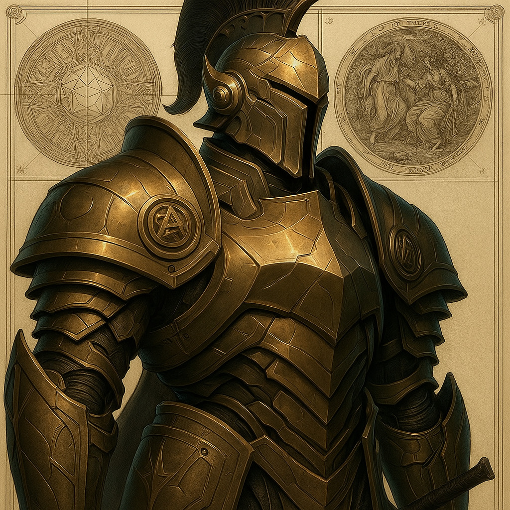

# Virtue — (He/Him)

<!-- Optional -->

---

## 📕 Details
**Pronouns:** He/Him  
**Titles/Aliases:**  
  -   

**Pre-ascension Species:** [Orc](../../../species/orc/index.md)  
**[Time Period](../../history/time_periods/) of Ascension:** The God Wars  
**[Pantheon](../../../pantheons):** [Gilgamites](../../../pantheons/gilgamites/index.md)  
**Divine Trial:** Unknown  
**LGBTQ+ Identifications:**  
      
  [Gay (MLM)](../../../identifiers/mlm/index.md)  

**Other Identifications:**  
  none  

**Theme Music:**  
<audio controls>
  <source src="virtue_|_geralt_of_rivia_|_the_witcher_ost.mp4" type="audio/mpeg">
  Your browser does not support the audio element.
</audio>

"Geralt of Rivia | The Witcher OST"  

---

## 🌀 Current Status

---

## 📜 History

---

## 👤 Physical Description

---
## 🧩 Notable Relationships
  - [Gilgamesh](../gilgamesh/index.md) - Friend/Leader  

---
