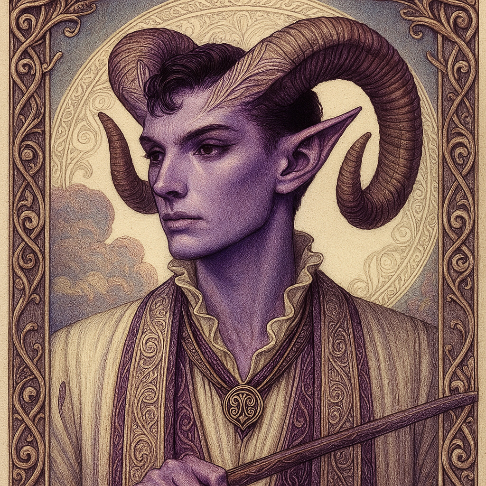

# Zagreus — (He/Him)

<!-- Optional -->

---

## 📕 Details
**Pronouns:** He/Him  
**Titles/Aliases:**  
  - The God of Pacifism  

**Pre-ascension Species:** Tiefling  
**[Time Period](../../history/time_periods/) of Ascension:** Age of Chaos  
**[Pantheon](../../../pantheons):** [Zagarans](../../../pantheons/zagarans/index.md)  
**Divine Trial:** Escape the underworld through diplomacy, not violence  
**LGBTQ+ Identifications:**  
      
  [Genderqueer](../../../identifiers/genderqueer/index.md)  
      
  [Aromantic](../../../identifiers/aromantic/index.md)  

**Other Identifications:**  

**Theme Music:**  
<audio controls>
  <source src="Zagreus | 07 From [Olympus](../../../locations/territories/olympia/index.md).mp3" type="audio/mpeg">
  Your browser does not support the audio element.
</audio>

"07 From Olympus"  

---

## 🌀 Current Status
Leader of the [Zagarans](../../../pantheons/zagarans/index.md)

---

## 📜 History
Convinced [Hades](../hades/index.md) to let him out of the last level of the Underworld

---

## 👤 Physical Description

---
## 🧩 Notable Relationships
  - [Dionysus](../dionysus/index.md) - (great friend)  
  - [Demeter](../demeter/index.md) - (mentor (former))  
  - [Hades](../hades/index.md) - (friend)  

---
