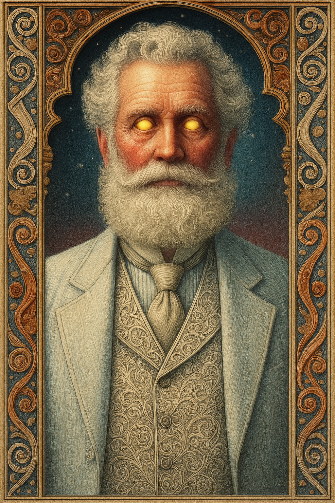

# Zeus — (He/Him)

<!-- Optional -->

---

## 📕 Details
**Pronouns:** He/Him  
**Titles/Aliases:**  
  - The God of Lightning  

**Pre-ascension Species:** [Human](../../../species/human/index.md)  
**[Time Period](../../history/time_periods/) of Ascension:** Age of Magic  
**[Pantheon](../../../pantheons):** [Demerans](../../../pantheons/demerans/index.md)  
**Divine Trial:** Travel the equator in the duration of a lightning strike  
**LGBTQ+ Identifications:**  
  none  

**Other Identifications:**  
  none  

**Theme Music:**  
<audio controls>
  <source src="zeus_|_great_grey_wolf_sif_-_dark_souls_soundtrack.mp4" type="audio/mpeg">
  Your browser does not support the audio element.
</audio>

"Great Grey Wolf Sif - Dark Souls Soundtrack"  

---

## 🌀 Current Status
Living in the city of [Redwater](../../../locations/cities/redwater/index.md), having very limited powers from healing the planes

---

## 📜 History
Sacrificed god powers after [Demeter](../demeter/index.md) super-ascension to save mortal plane from chaos

---

## 👤 Physical Description

---
## 🧩 Notable Relationships
  - [Hestia](../hestia/index.md) - Great friend  
  - [Demeter](../demeter/index.md) - Partner (former)  

---
