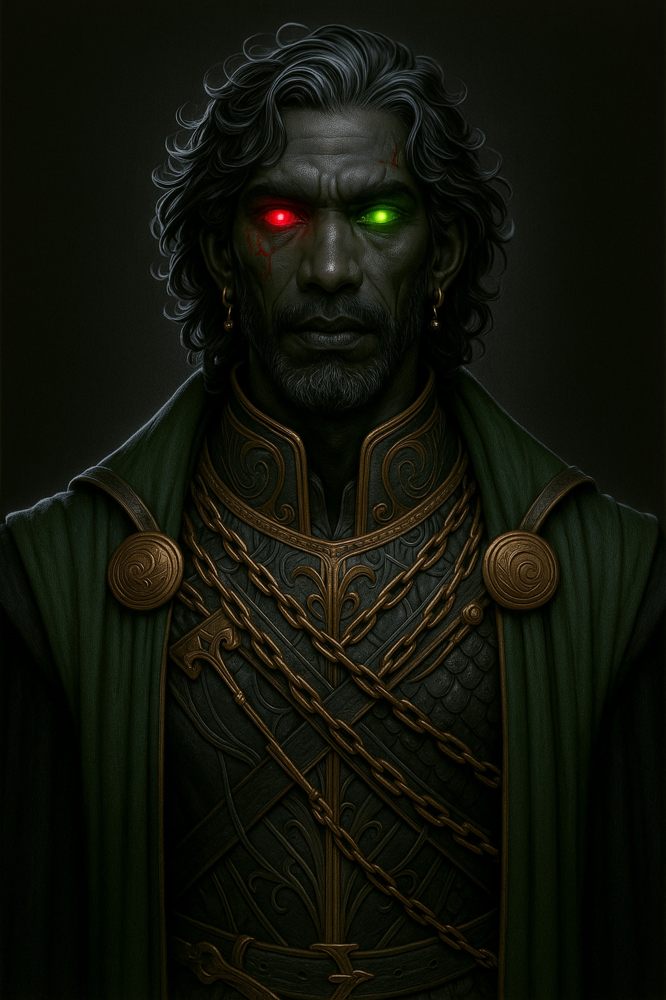

# Hades  --  (He/Him)

<!-- Optional  -->

---

**Pronouns:** He/Him  
**Titles:** {{ titles }}  
**Pre-ascension Species:** Half-Elf  
**Ascension Epoch:** The God Wars  
**Pantheon:** Underworlders  
**Trial:** Create A resting place for the dead

---

## 🌀 Current Status
Managing the Underworld

---

## 📜 History

---

## 🧠 Description
{{ description }}

---

## 🧩 Notable Relationships
Persephone - (wife) Aphrodite - (curious acquaintance) Demeter - (friend former) Charon - (created construct and employee) Eris - (employee) Thanatos - (loosely connected contractor) Osiris - (employee)
---
