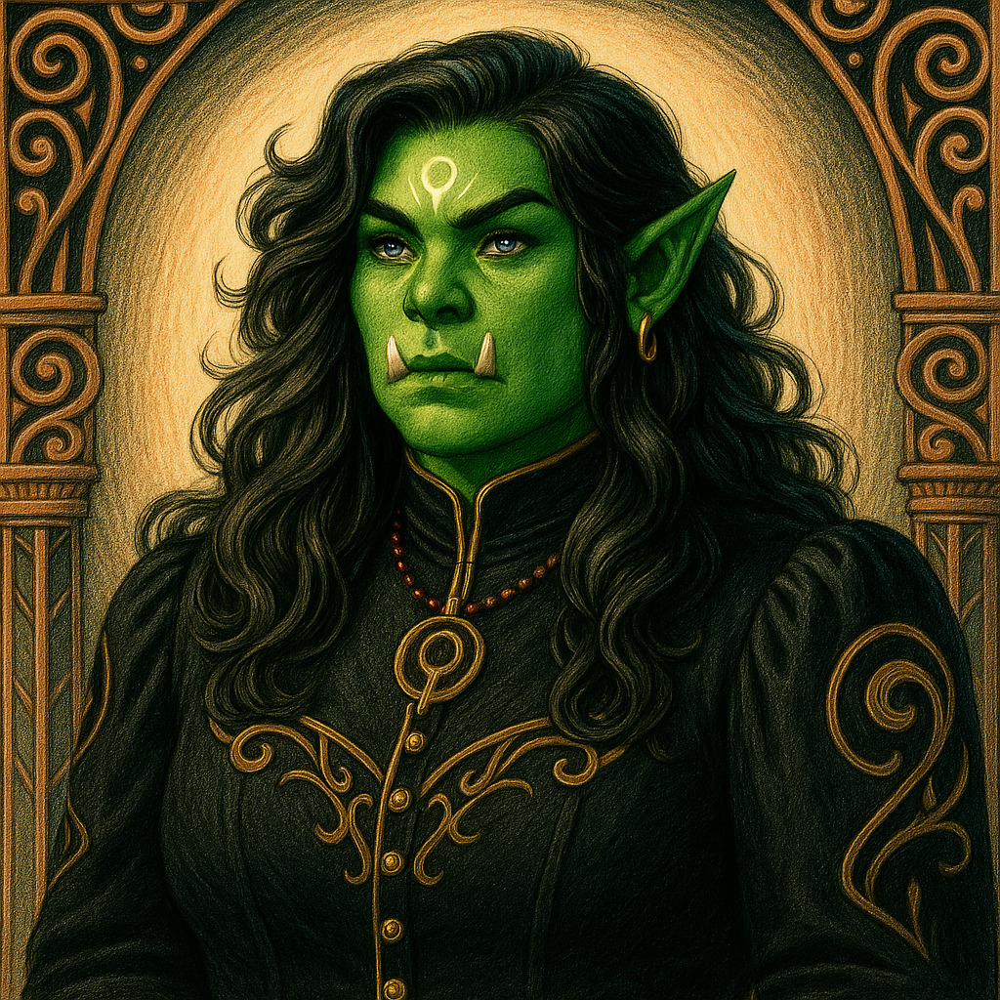

# Iranara  --  (She/Her)

<!-- Optional  -->

---

**Pronouns:** She/Her  
**Titles:** {{ titles }}  
**Pre-ascension Species:** Orc  
**Ascension Epoch:** Age of Division  
**Pantheon:** Athenians  
**Trial:** Unify the orcs in philosophy and politics

---

## 🌀 Current Status

---

## 📜 History

---

## 🧠 Description
{{ description }}

---

## 🧩 Notable Relationships
Orakothros - (husband)
---
