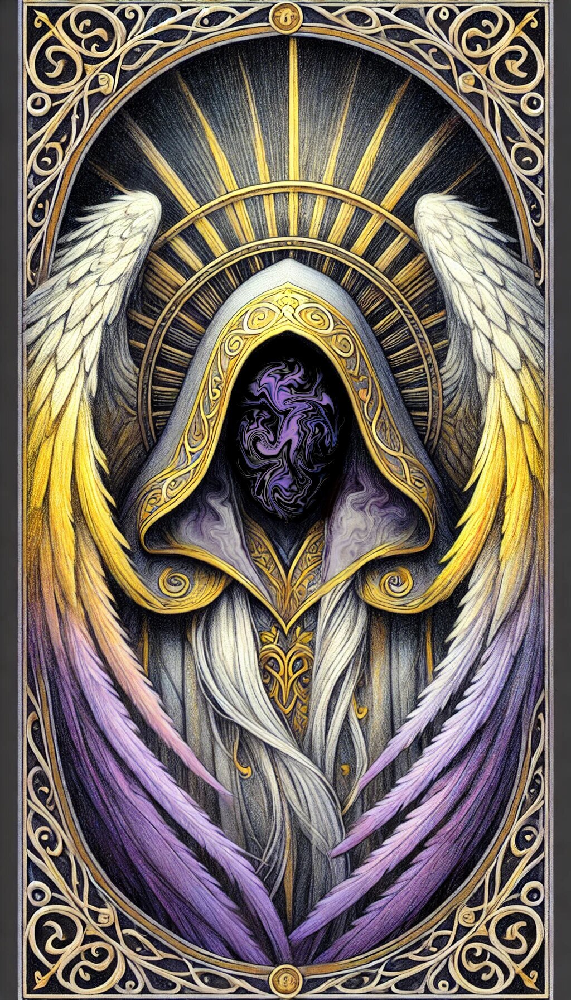

# Thanatos — (They/Them)

<!-- Optional -->

---

**Pronouns:** They/Them  
**Titles:** {{ titles }}  
**Pre-ascension Species:** Celestial  
**Ascension Epoch:** Age of Division  
**Pantheon:** [None](../../pantheons/None)  
**Trial:** Kill the god of Death
**LGBTQ+ Identifications:**   

**Theme Music:**  
<audio controls>
  <source src="Thanatos - Medieval Chant 'Dies Irae' - Epic background sound edit slowed.mp3" type="audio/mpeg">
  Your browser does not support the audio element.
</audio>

"Medieval Chant 'Dies Irae' - Epic background sound edit slowed"

---

## 🌀 Current Status

---

## 📜 History

---

## 🧠 Description
{{ description }}

---

## 🧩 Notable Relationships

---
