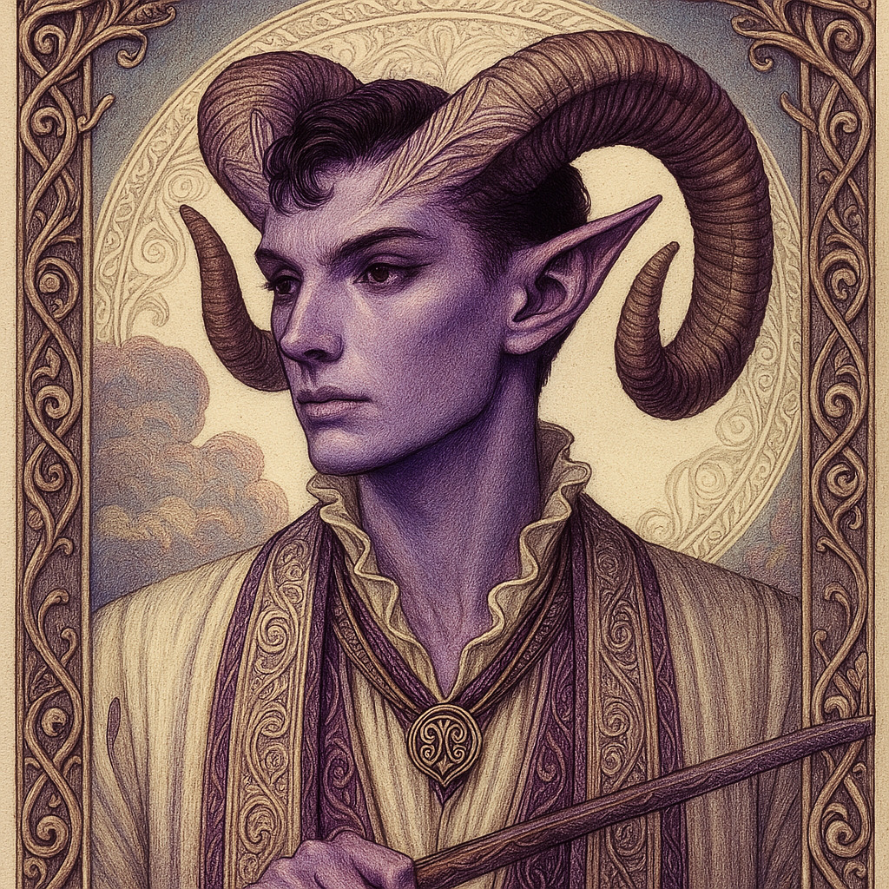

# Zagreus — (He/Him)

<!-- Optional -->

---

**Pronouns:** He/Him  
**Titles:** {{ titles }}  
**Pre-ascension Species:** Tiefling  
**Ascension Epoch:** Age of Chaos  
**Pantheon:** [Zagarans](../../pantheons/Zagarans)  
**Trial:** Escape the underworld through diplomacy, not violence
**LGBTQ+ Identifications:** genderfluid
gay wow  

**Theme Music:**  
<audio controls>
  <source src="Zagreus | 07 From Olympus.mp3" type="audio/mpeg">
  Your browser does not support the audio element.
</audio>

"07 From Olympus"

---

## 🌀 Current Status
Leader of the Zagarans

---

## 📜 History
Convinced Hades to let him out of the last level of the Underworld

---

## 🧠 Description
{{ description }}

---

## 🧩 Notable Relationships
Dionysus - great friend Demeter - mentor (former) Hades - friend
---
