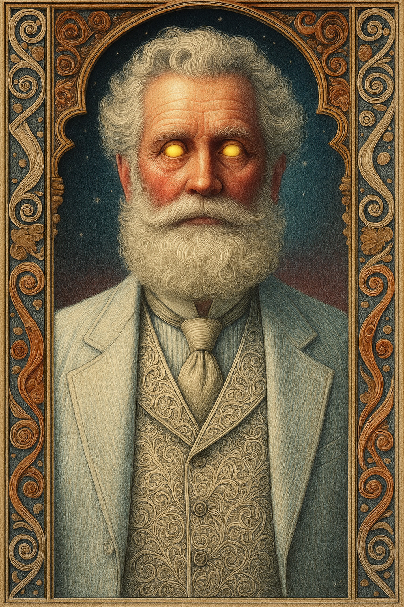

# Zeus — (He/Him)

<!-- Optional -->

---

**Pronouns:** He/Him  
**Titles:** {{ titles }}  
**Pre-ascension Species:** Human  
**Ascension Epoch:** Age of Magic  
**Pantheon:** [Demerans](../../pantheons/Demerans)  
**Trial:** Travel the equator in the duration of a lightning strike
**LGBTQ+ Identifications:**   

**Theme Music:**  
<audio controls>
  <source src="Zeus | Great Grey Wolf Sif - Dark Souls Soundtrack.mp4" type="audio/mpeg">
  Your browser does not support the audio element.
</audio>

"Great Grey Wolf Sif - Dark Souls Soundtrack"

---

## 🌀 Current Status
Living in the city of Redwater, having very limited powers from healing the planes

---

## 📜 History
Sacrificed god powers after Demeter super-ascension to save mortal plane from chaos

---

## 🧠 Description
{{ description }}

---

## 🧩 Notable Relationships
Hestia - Great friend Demeter - Partner (former)
---
